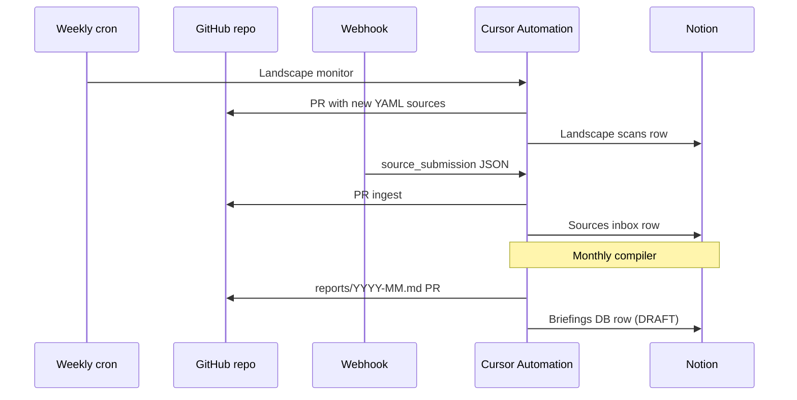

# Notion setup for UN80 WP15 Research

Mirror GitHub research outputs to Notion for editorial review and stakeholder access.

## Live hub (created)

**Hub page:** [UN80 WP15 Research Hub](https://www.notion.so/36805383491f813fa227f709c187584a)

| Database | Notion URL | Data source ID (for automations) |
|----------|------------|----------------------------------|
| Briefings | [Open](https://www.notion.so/f7ec4bd52e4542d9abc82d649afbc3a5) | `59dc0672-d74e-4e7b-bbfa-9d39ffe402e2` |
| Landscape scans | [Open](https://www.notion.so/053ca4ba780c415c878b69610ced5b9d) | `a3741a6d-60d3-46e3-a8d5-9e0bb80a47df` |
| Sources inbox | [Open](https://www.notion.so/2a617795d6294c86a91eb5d41779b0b1) | `c3ac8601-780a-4ae4-bc0c-2d1b04f198f5` |
| Automation log | [Open](https://www.notion.so/230e22d23f4c4cd0bcd22d43312fac2f) | `cc79cb1c-a897-488b-b913-02ff159f05ef` |

**Page IDs (copy into automation prompts / Memories):**

```
NOTION_HUB_PAGE_ID=36805383-491f-813f-a227-f709c187584a
NOTION_BRIEFINGS_DATA_SOURCE_ID=59dc0672-d74e-4e7b-bbfa-9d39ffe402e2
NOTION_LANDSCAPE_SCANS_DATA_SOURCE_ID=a3741a6d-60d3-46e3-a8d5-9e0bb80a47df
NOTION_SOURCES_INBOX_DATA_SOURCE_ID=c3ac8601-780a-4ae4-bc0c-2d1b04f198f5
NOTION_AUTOMATION_LOG_DATA_SOURCE_ID=cc79cb1c-a897-488b-b913-02ff159f05ef
```

Full machine-readable copy: `automations/workflows.json` → `notion_ids`.

## Connect to Cursor Automations

1. Enable **Notion MCP** on **Webhook ingest** and **Briefing compiler** automations
2. Enable **Memories** on all three automations
3. Attach repo `techpolicycomms/un80-wp15-research` @ `main`
4. Import via one-click prefill URLs in [prefill-urls.md](./prefill-urls.md)

## GitHub ↔ Notion flow



## Dashboard in Notion

**GitHub Pages URL:** https://techpolicycomms.github.io/un80-wp15-research/

Embed in the hub page via Notion `/embed` block, or link from the Dashboard section.

## Internal survey cross-reference (later)

When AI Toolkit inventory and org AI policy surveys produce **approved aggregates**:

- Add Notion database **Internal cross-reference (restricted)** in a private teamspace
- Do not copy raw survey rows into GitHub
- Fourth automation can pull approved aggregate bullets from Notion into briefing drafts
