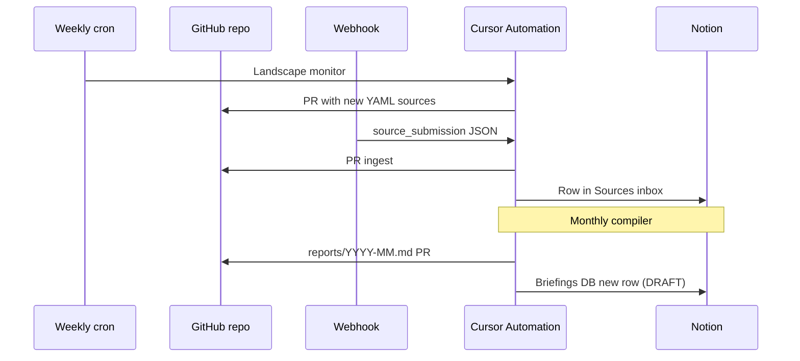

# Notion setup for UN80 WP15 Research

Mirror GitHub research outputs to Notion for editorial review and stakeholder access.

## Recommended Notion structure

Create a top-level page: **UN80 WP15 Research Hub**

Under it, create:

| Page / Database | Purpose |
|-----------------|--------|
| **Dashboard** (linked view) | Embed or link to GitHub Pages dashboard URL |
| **Briefings** (database) | Monthly Member State / CEB draft updates |
| **Landscape scans** (database) | Weekly scan summaries |
| **Sources inbox** (database) | Webhook-ingested public sources pending review |
| **Automation log** (database) | Run date, automation name, PR link, status |

### Briefings database properties

- **Title** — `UN80 WP15 — Member State Update (DRAFT) — YYYY-MM`
- **Status** — Draft | In review | Approved
- **Period** — date
- **GitHub PR** — URL
- **Actions covered** — multi-select: Action 61, Action 62
- **Work package** — WP15

### Sources inbox properties

- **Title** — source title
- **URL** — link
- **Relevance** — Action 61 / Action 62 / Both
- **Topic** — text
- **Submitted by** — text
- **GitHub PR** — URL
- **Review status** — Pending | Accepted | Rejected

## Connect to Cursor Automations

1. Enable **Notion MCP** on the **Monthly briefing compiler** automation
2. Enable Notion MCP on **Webhook ingest** (optional) to append rows to Sources inbox
3. In automation prompts, reference page/database names exactly as created above

## Manual sync (without automation)

From Cursor chat with Notion MCP:

```
Search Notion for "UN80 WP15 Research Hub"
Create a briefing page from reports/YYYY-MM-member-state-update.md
```

Use the `research-documentation` skill pattern: search → synthesize → create structured page.

## GitHub ↔ Notion flow



## Dashboard in Notion

Option A: **Link** to GitHub Pages URL (`https://techpolicycomms.github.io/un80-wp15-research/`)  
Option B: **Embed** using Notion embed block (if Pages site is public)  
Option C: Paste key metrics manually from `dashboard/dist/data.json` into a Notion callout (fallback)

## Page IDs (fill in after creation)

After you create the Notion hub, paste IDs here for automation prompts:

```
NOTION_HUB_PAGE_ID=
NOTION_BRIEFINGS_DATABASE_ID=
NOTION_SOURCES_DATABASE_ID=
```

Store these as automation environment notes or in Memories — not as secrets.

## Internal survey cross-reference (later)

When AI Toolkit inventory and org AI policy surveys produce **approved aggregates**:

- Add Notion database **Internal cross-reference (restricted)** — link only from private Notion teamspace
- Do not copy raw survey rows into GitHub
- Fourth automation can pull approved aggregate bullets from Notion into briefing drafts
